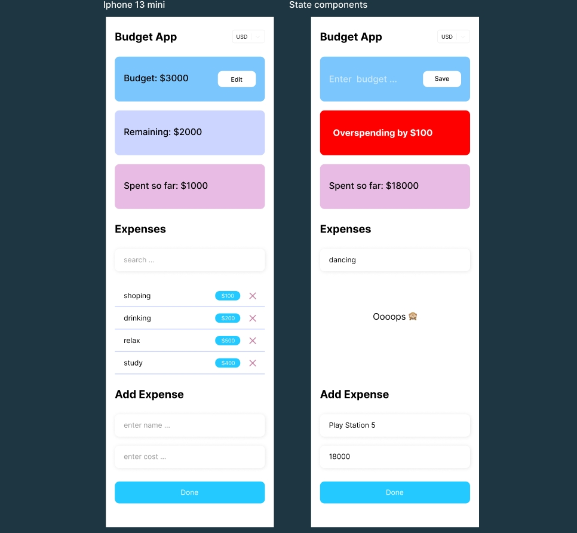

<!-- PROJECT LOGO -->
 

   
  </a>

  <h3 align="center">Welcome to Your Mobile Budget Application!</h3>

  

   The application calculates your expenses and budget and improve your financial literacy.
     
    <a href="#"><strong>Explore the application</strong></a>
     
     
   

  

<!-- ABOUT THE PROJECT -->

## About The Project

This is a user-friendly budgeting tool designed to help you keep track of your expenses and manage your finances effectively. With this mobile application, you can easily create a budget plan and monitor your spending.

Getting started is easy! Simply create a new budget by entering your income and expenses for the month.

As you make purchases, add them to the application to keep track of your spending. The application will automatically update your budget and show you how much money you have left to spend.

The app will also show if the expenses have been exceeded.

## Built With

## The tools that were used in this project:

- Typescript
- React-select
- React-hook-form
- Hooks & Custom Hooks
- Styled-components

<!-- CONTACT -->

## Contact

Aksana Manchuk - [https://www.linkedin.com/in/oksana-manchuk]
[oxana.manchuk@mail.ru]

Project Link: [https://github.com/oksanaweb/react-budget-app]
